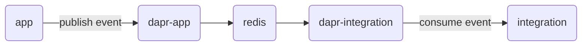

# Integration testing using Testcontainers for Dapr based applications

> This repository provide an example of running integration test against
> microservices using [Testcontainers][testcontainers] and [Dapr][dapr].

## Overview



This setup involves spinning up four containers to simulate a realistic microservice environment:

1. **Application Container (`app`)**: This container hosts the primary
   application, which exposes the `/orders` API endpoint on port 3000. This
   endpoint will be used to initiate the test.
2. **Dapr Sidecar (`dapr-app`)**: Acting as a sidecar to the `app` application,
   this container required for enabling Dapr's capabilities, such as pub-sub,
   service invocation and state management, in the application.
3. **Redis Container (`redis`)**: Redis serves as the pub-sub broker in our
   integration test environment, facilitating message passing and event handling.
4. **Dapr Integration Container (`dapr-integration`)**: This specialized
   container is tasked with forwarding the events received from our application
   to a local server, which is created as part of the integration test and
   operates on port 6002.

The integration test involves executing a PUT request to `/orders/order-1234`
on our application container. This request triggers the application to publish
an event to Redis using Dapr's pub-sub component. The test then verifies
whether the event has been correctly transmitted to and received by the message
broker.

## Getting started

```bash
export DOCKER_HOST=unix://$(podman machine inspect --format '{{.ConnectionInfo.PodmanSocket.Path}}')
export TESTCONTAINERS_RYUK_DISABLED=true

go test -v ./...
```

<!-- links -->
[dapr]: https://dapr.io
[testcontainers]: https://testcontainers.com/
